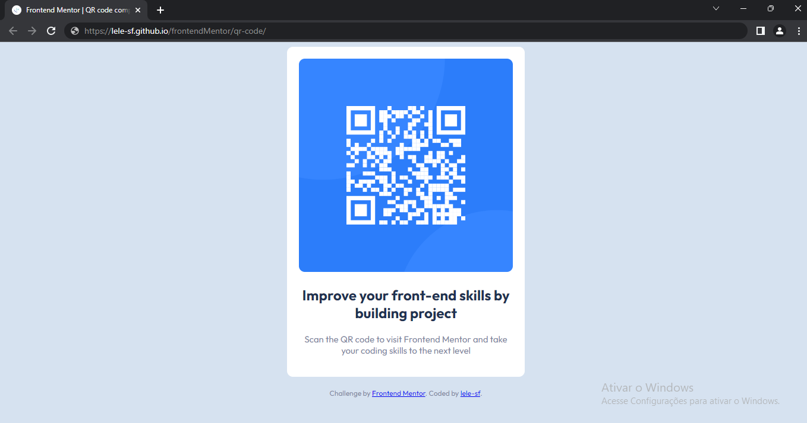

# Frontend Mentor - QR code component solution

This is a solution to the [QR code component challenge on Frontend Mentor](https://www.frontendmentor.io/challenges/qr-code-component-iux_sIO_H). Frontend Mentor challenges help you improve your coding skills by building realistic projects. 

## Table of contents

- [Overview](#overview)
  - [Screenshot](#screenshot)
  - [Links](#links)
- [My process](#my-process)
  - [Built with](#built-with)
  - [What I learned](#what-i-learned)
  - [Continued development](#continued-development)
  - [Useful resources](#useful-resources)
- [Author](#author)
- [Acknowledgments](#acknowledgments)

## Overview

### Screenshot

### Links

- Solution URL: [Add solution URL here](https://your-solution-url.com)
- Live Site URL: [Click here](https://lele-sf.github.io/frontendMentor/qr-code/)

## My process

### Built with

- HTML5
- CSS3
- Flexbox
- Mobile-first workflow

### Continued development

I would like to continue learning and improving my skills in creating responsive layouts and using CSS3 features like custom properties and animations.

### Useful resources

- [CSS Tricks](https://css-tricks.com/) 
- [MDN Web Docs](https://developer.mozilla.org/en-US/)

## Author

- GitHub - [lele-sf](https://github.com/lele-sf)
- Frontend Mentor - [@lele-sf](https://www.frontendmentor.io/profile/lele-sf)

## Acknowledgments

- The Frontend Mentor team for providing the design and assets for this project.

