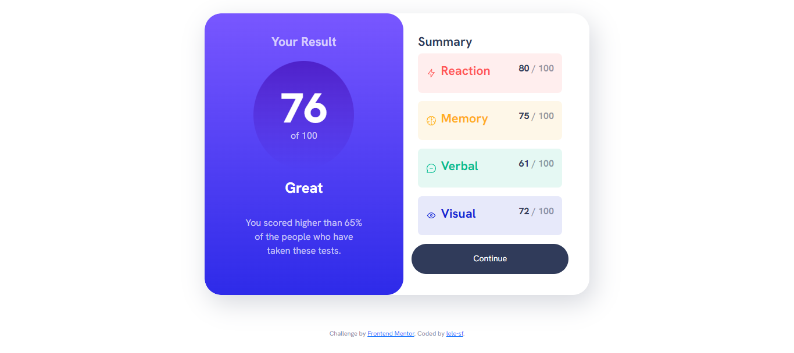

# Frontend Mentor - Results summary component solution

This is a solution to the [Results summary component challenge on Frontend Mentor](https://www.frontendmentor.io/challenges/results-summary-component-CE_K6s0maV). Frontend Mentor challenges help you improve your coding skills by building realistic projects. 

## Table of contents

- [Overview](#overview)
  - [The challenge](#the-challenge)
  - [Screenshot](#screenshot)
  - [Links](#links)
- [My process](#my-process)
  - [Built with](#built-with)
  - [What I learned](#what-i-learned)
  - [Continued development](#continued-development)
  - [Useful resources](#useful-resources)
- [Author](#author)
- [Acknowledgments](#acknowledgments)

## Overview

### The challenge

Users should be able to:

- View the optimal layout for the interface depending on their device's screen size
- See hover and focus states for all interactive elements on the page

### Screenshot

### Links

- Solution URL: [Add solution URL here](https://your-solution-url.com)
- Live Site URL: [Add live site URL here](https://your-live-site-url.com)

## My process

### Built with

- Semantic HTML5 markup
- CSS custom properties
- Flexbox
- CSS Grid
- Mobile-first workflow
- Bootstrap

### What I learned

Through this project, I had the opportunity to delve into Bootstrap for the first time, and it proved to be a valuable learning experience, highlighting the power and versatility of the framework, while also revealing that there is still much more to discover and master.

### Continued development

In future projects, I would like to further explore Bootstrap and its various components to enhance my front-end development skills.

### Useful resources

- [CSS Tricks](https://css-tricks.com/) 
- [MDN Web Docs](https://developer.mozilla.org/en-US/)
- [Bootstrap Documentation](https://getbootstrap.com/docs/5.3/getting-started/introduction/)

## Author

- GitHub - [lele-sf](https://github.com/lele-sf)
- Frontend Mentor - [@lele-sf](https://www.frontendmentor.io/profile/lele-sf)

## Acknowledgments

I would like to acknowledge the Frontend Mentor community for providing this challenge and the resources that helped me during the development process.

